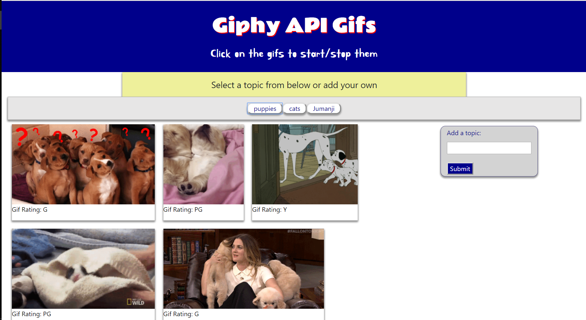

<h1 align="center">
Giphy API Gifs
</h1>

This is a dynamic webpage that will display 16 gifs and their ratings when a topic button is pressed.  
There is also an input field
on the right-hand side that allows you to dynamically add a button to the top of the 
page to generate gifs.  This project will be useful 
for entertaining children (or a child-like adult) for short periods 
of time.  To get started, simply click one of the predefined buttons at the top of the page or enter a term into the 
input field to generate a new button.

---
[CLICK ME to see it in action](https://olivas1406.github.io/gifs/)
 
---

This project was created and is maintained by Daniel Olivas

To get help:  
me@danielolivas.net 
http://danielolivas.net
              